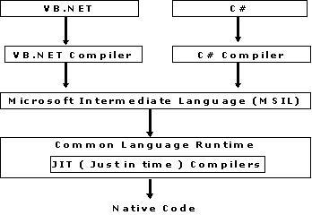

# This file contains the basic of .net

### 1. .Net Core

.Net core is the new Microsoft's .Net framework designed to build cross-paltform softwares. It is free, open-source, general purpose programming platform that works for Windows, MacOS, Linux, Android, iOS and more. With the use of .Net core we can create apps, wweb development, desktop applications. cloud, IoT, Machine learning models, microservices, games and many more. It is build on the concept of create once, run anywhere.

### 2. .Net Framework

The framework is a reusable design platform for software system, which provides support for code libraries and various scripting languages. Microsoft .Net framework is a software development platform for building and running Windows applications. .Net framework contains developer tools, programming languages and libraries that are used to develop desktop and web applications.

### 3. Difference between .Net Core and .Net Framework

<b><u>Framework<u></b>

.Net Core: it is cross platform, where we can create apps for Windows, Linux, MacOS, Android. iOS and more. It is based on Universal Windows Platform

.Net Framework: it is fully development framework that provides all the basic requirements for the development of applications such as UI, DB connectivity, services, APIs etc.

<b><u>Platform<u></b>

.Net Core: it is cross platform, where we can create apps for Windows, Linux, MacOS, Android. iOS and more. It is based on Universal Windows Platform

.Net Framework: it is only compatible with Windows OS only

<b><u>Microservices<u></b>

.Net Core: it supports microservices that allows a mix of technologies that can be minimalized for each microservices.

.Net Framework: it does not allow for the construction and deployment of microservices in multiple languages.

### .Net Core Architecture

- <b>Core CLR</b>: Core CLR is the Common Language Runtime optimized for multiplatform and cloud-based deployments. This, along with .Net Native Runtime, forms the foundation of all .Net based platforms.

- <b>.Net Native Runtime (Managed Runtime)</b>: It is also called Managed Runtime, that contains the native windows based libraries. This also contains Ahead Of Time (AOT) compilation instead of Just In Time (JIT) compilation. This improves the performance of the applications. The .Net Native Runtime and the Core CLR are the layers that contain implementations of primitive types as well as generic collections in .Net APIs.

- <b>Unified Base Class Library (Unified BCL)</b>: The Unified Base Class Library, also referred to as CoreFX, consists of the basic and fundamental classed that form the core of the .Net Core platform.

- <b>App Models</b>: App Models is on the top of the UBCL layer. It leverage developers to develop platform-specific applications.

### What are some common .Net components

1. .Net Class Library

2. .Net Framework

3. Language Runtime

4. Application Domain

5. Profiling

these are the most common .Net component, however there are many.

### What is Intermediate Language (IL) OR MSIL (Microsoft Intermediate Language) or CLI (Common Intermediate Language)

During the compile time the source code converted into intermediate language. As the .Net framework is shipped with compliters of all .Net programming languages to develop programs. There are separate compilers for the VB.Net, C#.Net. Each .Net compiler produces an intermediate code after compiling the source code. The intermediate code is common for all languages and it understandable only to .Net encironment. This intermediate code is known as MSIL.

MSIL provides instructions for calling methods, storing and initializing values, memory handling, exception handling and so on. ALl the .Net codes are first compilted to Intermediate Language.

All .Net source code is compiled to IL. This IL is then converted to machine code at the point where the software installed, or at run-time by a just-in-time compiler.

### What is CLR or Common Language Runtime?

CLR provides an environment to execute .Net applications on target machines. CLR is a common runtime environment for all .Net code irrespective of their programming language, as the compilers of respective language in .Net framework convert every source code into a IL.

The code runs under the CLR is called as Managed Code.

CLR perform following responsibilities

1. Garbage Collection: CLR automatically manages memory thus eliminating memory leaks. When objects are not referred GC automatically releases those memories thus providing efficient memory management.

2. Code Access Security: CAS grants rights to program depending on the security configuration of the machine.

3. Code Verification: This ensures proper code execution and type safety while the code runs. It prevents the source code to perform illigal operation such s accessing invalid memory location atc.

4. IL to native translator and optimizer's: CLR uses JIT and compiles the IL code to machine code and then executes. CLR also determines dependeng on platform what is optimized way of running the IL code.

### What is CTS or Common Type System

In order that two language communicate smoothly CLR has CTS. For example, in VB "Integer" in C++ "long". These datatypes are not compatible so the interfacing between them is very complicated. In order to able that two different languages can communicate Microsoft introduced Common Type System. So "Integer" datatype in VB6 and "int" datatype in C++, convert it to System.int32 which is CTS datatype.

It describes set of data types that can be used in different .Net languages in common. CTS ensures that objects written in different .Net languages can interact with each other.

The CTS supports two general categories of types:

Value Types:

Value types directly contain their data, and instances of value types are either allocated on the stack or inline in a structure. Value types can be built-in, user-defined, or enumerations.

Reference Type:

Reference types store a reference to the value's memory address, and are allocated on the heap. Reference types can be self-describing types, or interface types.

### Common Language Specification (CLS):

It is a sub set of CTS and it speficies a set of rules that need to be followed by all language compilers targetting CLR. It helps in cross language inheritance and cross language debugging.
